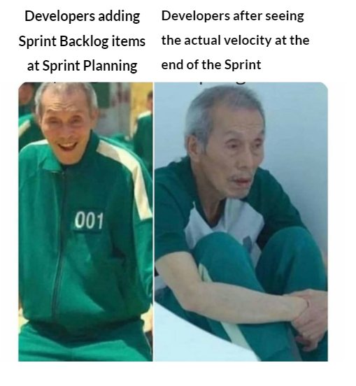

## Context:

Deze week was maandag een nationale feestdag, waardoor alle sprintmeetings verschoven naar dinsdag. Dat gaf meteen de toon aan: eindelijk een echte sprint met een duidelijke planning en concrete taakverdeling voor iedereen.

## Wat heb ik gedaan:

- **Sprint planning afgerond**: dinsdag een volledige update gehad van sales en dev, gevolgd door een sprint planning. Voor het eerst echt duidelijke afspraken gemaakt over wie wat doet. Ik heb voor mezelf 10% slack ingebouwd: één groot ticket van 8 story points en een aantal kleinere van 0.5 tot 2 points. Bij ons staat 1 story point gelijk aan één dag.
- **Word plugin UI migratie opgestart**: het grootste ticket van de sprint is de migratie van de Word plugin naar het nieuwe UI-componentsysteem. Een grote taak die naar schatting 1 tot 1.5 week in beslag neemt.
- **CV-assistant bijna af**: de CV-assistant is nagenoeg volledig. Er zijn nog 3 UI-schermen over die afgewerkt moeten worden.
- **UI-package pipeline afgerond**: de pipeline voor de UI-components is eindelijk klaar. Ik heb de package-configuratie ook aangepast zodat de CSS mee in de module wordt opgenomen, waardoor er geen aparte CSS-import meer nodig is bij gebruik van de componenten. Een clean verbetering die integratie makkelijker maakt.
- **Component audit met AI**: via Figma-tokens en een AI heb ik een audit gedaan van alle schermen. Zo kon ik automatisch bepalen welke componenten al bestaan en welke nog ontbreken. Resultaat: een overzichtelijke lijst van wat er nog geïmplementeerd moet worden. De Figma MCP rate limit (6 requests/maand op de gratis tier) omzeild via een token-based API-aanpak.
- **NPM authenticatie via Azure Pipelines**: een echte pijnpunt deze week. npm met authenticatie via Azure Pipelines is bijzonder frustrerend geconfigureerd. Ik heb hier meer tijd aan verloren dan verwacht.
- **Windows filesystem problemen**: npm packages verwijderd om problemen op te lossen, maar Windows verplaatst bestanden eerst naar de prullenbak in plaats van ze direct te wissen. Die moeten dan apart geleegd worden,  een absurde extra stap die onnodige vertraging veroorzaakte.
- **Policy voor UI-package**: donderdag ingezien dat er binnenkort een formele policy moet worden geschreven voor de UI-package, zodat die goed beschermd en beheerd wordt naarmate hij stabieler wordt.
- **Code review**: gevraagd om website-code te reviewen als oefening voor de persoonlijke vaardigheid code review. Er zijn ook gesprekken over het opzetten van een formeel PR-reviewproces voor de UI-package.
- **Gesprek met CEO over AI-gebruik**: een goed gesprek gehad over hoe we AI inzetten. De CEO loopt tegen zijn sessielimieten aan. Mijn hypothese: ik bereik die limieten minder snel omdat ik voldoende en duidelijke context meegeef aan de agent, waardoor taken in één shot lukken in plaats van meerdere iteraties.
- **CV-beoordelingsagent opgezet**: om mijn eigen token-gebruik te verhogen, ben ik gestart met het schrijven van een agent die CVs automatisch beoordeelt aan de hand van meerdere tools. De agent krijgt uitgebreide context via een prompt, heeft toegang tot de nodige bestanden en werkt autonoom. Een concrete toepassing om te leren hoe je AI effectief inzet voor repetitieve evaluatietaken.
- **Inzicht over AI en frontend design**: gemerkt hoe slecht AI momenteel is in frontend design voor mobiel. Voor mobile-specifieke UI-beslissingen blijft handmatige sturing onmisbaar.

## Blockers:

- **Windows filesystem gedrag**: het verwijderen van node_modules via Windows verloopt trager dan op Unix door het prullenbakgedrag. Veroorzaakte onnodige vertraging.
- **NPM authenticatie via Azure Pipelines**: de configuratie van private npm-packages met authenticatie in een Azure-pipeline is omslachtig en slecht gedocumenteerd.

## Resultaat:

- Sprint gepland met duidelijke taakverdeling en verwachtingen voor iedereen.
- UI-component pipeline volledig operationeel; CSS-bundeling verbeterd.
- Component audit afgerond: duidelijk overzicht van wat nog geïmplementeerd moet worden.
- CV-beoordelingsagent opgezet met uitgebreide prompt en autonome werking.
- Word plugin UI-migratie opgestart als groot sprintticket.

## Volgende stappen:

- Word plugin UI-migratie verder uitwerken richting oplevering.
- Resterende 3 UI-schermen van de CV-assistant afwerken.
- Policy schrijven voor de UI-package.
- CV-beoordelingsagent testen en verfijnen op basis van eerste resultaten.
- Team demo van self-service bijwonen op maandag 14 april en feedback verwerken.

## Reflectie:

Eindelijk een sprint met echte structuur. Dat maakt een groot verschil voor focus en rust: je weet wat er van je verwacht wordt en je kan prioriteiten stellen. De 10% slack die ik heb ingebouwd, voelt nu al als een slimme keuze.

Het gesprek met de CEO over AI was waardevol. Het bevestigde een intuïtie die ik al had: de kwaliteit van de output hangt grotendeels af van de kwaliteit van de input. Goede context geven is een vaardigheid, geen bijzaak. De CV-agent is deels een experiment om dat verder te testen,  en tegelijk een nuttige tool die echte waarde kan leveren.

Windows blijft een bron van frustratie voor development. Niet de eerste keer, waarschijnlijk ook niet de laatste.

## Samenvatting:

- Sprint planning afgerond met duidelijke taakverdeling en 10% slack
- Word plugin UI-migratie opgestart als groot ticket
- UI-component pipeline afgerond inclusief CSS-bundeling in de module
- Component audit uitgevoerd via AI en Figma-tokens
- NPM authenticatie via Azure Pipelines geconfigureerd (moeizaam)
- Policy voor UI-package geïdentificeerd als volgende stap
- Goed gesprek met CEO over AI-gebruik en sessielimieten
- CV-beoordelingsagent opgezet voor autonome CV-evaluatie
- Inzicht: AI schiet tekort voor mobile frontend design
