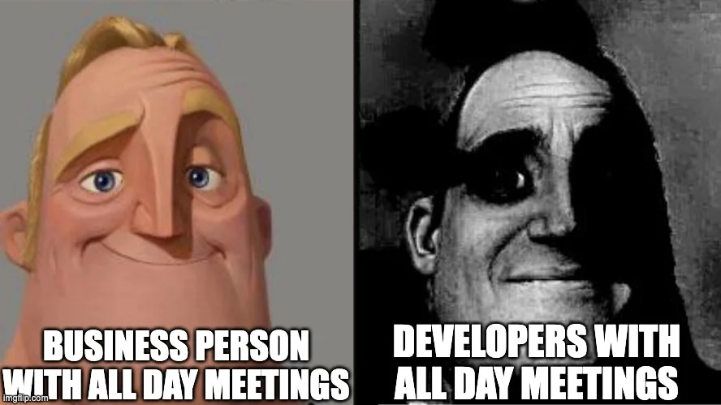

## Context:

Maandag was de hele dag gevuld met meetings in Hasselt, waardoor ik weinig aan mijn taken kon verder werken. De rest van de week stond grotendeels in het teken van de Word plugin, een onverwachte feature request en de opzet van een testinfrastructuur.

## Wat heb ik gedaan:

- **Word plugin UI afgerond**: dinsdag tot en met vrijdag intensief gewerkt aan de Word plugin. De UI was zo goed als klaar met nog een paar kleine aanpassingen na feedback van de CEO op donderdag.
- **Feature request van de CEO**: op dinsdag kreeg ik een feature request binnen van de CEO. Ik heb hier een mock van gemaakt om mijn idee te visualiseren. Na een gesprek met de CEO en de CTO tijdens de weekly meeting zijn we samen tot een goed uitgewerkt idee gekomen.
- **Volledige planningsverantwoordelijkheid**: ik mag de volledige planning opmaken voor de nieuwe feature, inclusief taken en implementatie. De tickets en user stories zijn al uitgeschreven en ik ben begonnen met de v1-implementatie.
- **Testinfrastructuur opgezet**: de basis voor zowel manuele als automatische testen uitgewerkt. Wanneer automatische testen falen, kunnen de handmatige als fallback dienen. Ik heb ook een skill geschreven zodat iedereen — ook mensen zonder of met weinig testervaring — fatsoenlijke testen kan schrijven.
- **Mocking voor Word plugin**: onderzoek gedaan naar hoe Word correct gemockt kan worden voor testing, zodat de plugin ook als website bezocht kan worden tijdens ontwikkeling.
- **AI en Figma**: versteld gestaan van wat Claude kan doen met een Figma-link. Claude heeft de designs gedownload, nagezien welke elementen al bestaan en welke niet, die gemapped en er een overzichtelijke implementatielijst van gemaakt.
- **Veel AI-tokens gebruikt**: donderdag en vrijdag heb ik heel veel tokens gebruikt door zowel de codebase van de backend als de frontend mee te geven aan de AI. De feature is correct geïmplementeerd.
- **Dev environment setup met Nima**: Nima geholpen bij het opzetten van de lokale dev-omgeving: repo clonen, authenticatieproblemen met personal access tokens oplossen, verbinden met de Saply AI artifact feed en VS Code + lokale server werkend krijgen.
- **UI-review met Nima**: samen de UI doorgelopen. Clean design goedgekeurd, file upload werkt, multi-language support bevestigd. Één issue gevonden: de strengths-sectie opent onderaan de pagina in plaats van naar boven te scrollen.

## Blockers:

- **Maandag volledig bezet door meetings**: door de hele dag meetings in Hasselt weinig kunnen bijdragen aan de sprint taken.
- **Windows frustraties**: ook deze week weer gefrustreerd door het gedrag van Windows tijdens development.

## Resultaat:

- Word plugin UI nagenoeg afgerond na CEO-feedback.
- Feature request uitgewerkt tot concreet plan met tickets, user stories en v1-implementatie.
- Testinfrastructuur opgezet met manuele en automatische testen als fallback-strategie.
- Skill geschreven voor het schrijven van testen, toegankelijk voor iedereen.
- Dev environment van Nima volledig geconfigureerd en operationeel.

## Volgende stappen:

- Resterende aanpassingen aan de Word plugin verwerken.
- v1 van de nieuwe feature verder uitwerken en verfijnen.
- Automatische testen uitbreiden en valideren.
- UI-bug oplossen waarbij de strengths-sectie niet naar boven scrolt bij openen.

## Reflectie:

Maandag voelde heel unproductief aan door de meetings, maar de rest van de week was des te intenser. De onverwachte feature request was een leuke uitdaging: van idee naar mock naar gezamenlijk plan in één week, met ook nog de volledige planningsverantwoordelijkheid. Dat geeft vertrouwen.

De testopzet was technisch uitdagend, vooral het mocking-gedeelte voor Word. Het schrijven van een skill zodat ook minder ervaren collega's goede testen kunnen schrijven, voelt als een waardevolle bijdrage aan het team.

Wat betreft AI: de combinatie van Claude en Figma is indrukwekkend. Het feit dat een link volstaat om een volledige component-audit te doen, bespaart enorm veel tijd.

## Samenvatting:

- Maandag volledig bezet door meetings in Hasselt
- Word plugin UI afgerond na CEO-review en feedback
- Feature request ontvangen, gemockt en uitgewerkt samen met CEO en CTO
- Volledige planningsverantwoordelijkheid gekregen voor nieuwe feature
- Testinfrastructuur opgezet met manuele en automatische testen
- Skill geschreven voor toegankelijk testen schrijven
- Word plugin mocking onderzocht en opgezet
- Dev environment van Nima geconfigureerd
- UI-bug gevonden: strengths-sectie scrolt niet naar boven
