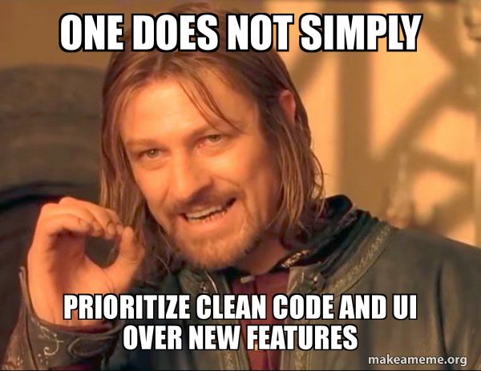

## Context:

Week 12 draaide grotendeels om de finish van de Word plugin. Oorspronkelijk had ik twee weken, maar de deadline werd vervroegd: donderdag moest de plugin gedeployed zijn en volledig in orde. Woensdag was hij klaar, donderdag succesvol gedeployed. Vrijdagochtend was ik afwezig door school.

## Wat heb ik gedaan:

- **Word plugin afgerond en gedeployed**: woensdag klaar, donderdag live zonder problemen. De automatische testen die ik eerder had opgezet speelden een grote rol in het vlot verlopen van de deployment. Een grote verantwoordelijkheid, goed afgerond.
- **OTP login flow afgerond (ticket #694)**: gebruikers die inloggen via OTP zonder actief abonnement konden geen requests sturen. Oplossing: na het inloggen een subscription check toevoegen. Als het account nog niet volledig actief is, verschijnt een duidelijke melding met een doorverwijzing naar app.saply.ai voor setup. Zo blijft de Word plugin clean — geen aparte sign-up flow nodig.
- **DTO bug gefixt**: DTO-wijzigingen verschenen niet correct bij deployment, wat conflicten veroorzaakte. Bug geïdentificeerd en opgelost.
- **Dev database migratie issue opgelost**: een migratieprobleem in de dev-omgeving dat woensdagavond opdook, opgelost voor de standup van donderdag.
- **Bridge template extractie bug gefixt**: maandag toegewezen als prioriteit en opgelost. De extractie van de Bridge template verliep niet correct bij meerdere templates.
- **Tickets #816 en #717 opgestart**: beide taken gelijktijdig opgepakt samen met de feedback feature.
- **Eerste mail naar een klant gestuurd**: de mail was inhoudelijk goed, maar achteraf gezien kon het beleefder. "U" in plaats van "je" gebruiken is de voornaamste les voor volgende keer.
- **Claude remote werkend gekregen**: eindelijk in staat om via mijn gsm, browser en server tegelijk te werken met AI-ondersteuning voor het schrijven van code. Grote tijdswinst.

## Blockers:

- **DTO bug**: tijdelijk blocker, opgelost.
- **Dev database migratie**: tijdelijk blocker, opgelost.
- **Continu overleg over kwaliteit**: er was een opmerking dat ik meer zou moeten testen. Dat vond ik vreemd, aangezien er al automatische testen klaarstonden. Het constante heen-en-weer over wat beter kon, kostte meer tijd dan de effectieve aanpassingen.

## Resultaat:

- Word plugin tijdig afgerond en zonder problemen gedeployed, mede dankzij de automatische testen.
- OTP login flow volledig afgerond met subscription check en gebruikersvriendelijke melding.
- DTO bug en dev database migratie issue beide opgelost.
- Bridge template extractie bug gefixt.
- Eerste klantmail verstuurd.
- Claude remote operationeel.

## Volgende stappen:

- Feedback feature en ticket #717 verder afwerken.
- Beleefdheidsnormen in klantcommunicatie verder aanscherpen (u-vorm).

## Reflectie:

De Word plugin afronden binnen de vervroegde deadline voelt als een echte mijlpaal. Wat het extra bevredigend maakt: de deployment liep vlekkeloos, en de automatische testen die ik eerder had opgezet bewezen hun waarde. Dat soort investeringen betalen zich op het juiste moment terug.

De opmerking dat ik meer zou moeten testen terwijl er al automatische testen klaarstonden, was frustrerend. Soms lijkt het alsof mensen niet goed weten wat er al aanwezig is. Gelukkig spreken de resultaten voor zich.

De eerste klantmail was een leerzaam moment. Inhoudelijk goed, maar toon en beleefdheidsnormen zijn ook een vaardigheid — en die kun je bijschaven.

De ISO pc-discussie was een principieel gesprek dat ik bewust ben aangegaan. Ik heb duidelijk gemaakt dat ik geen probleem heb met mijn eigen pc gebruiken voor Saply, maar wel een probleem heb met het aanpassen van mijn persoonlijke machine voor hun vereisten. Een remote pc is een valabele optie, maar dan moeten ze die betalen. Mijn standpunt, helder gecommuniceerd.

Claude remote werkend krijgen is iets wat ik al een tijdje wou. Nu kan ik vanop gelijk welk apparaat mijn ontwikkelomgeving aansturen. Dat is een concrete verbetering in mijn workflow.

## Samenvatting:

- Word plugin afgerond (woensdag) en gedeployed (donderdag), vlekkeloos dankzij automatische testen
- OTP login flow afgerond met subscription check en doorverwijzing (ticket #694)
- DTO bug en dev database migratie opgelost
- Bridge template extractie bug gefixt
- Tickets #816 en #717 opgestart
- Eerste klantmail verstuurd — les: gebruik "u" in plaats van "je"
- ISO pc-discussie: standpunt duidelijk ingenomen
- Claude remote eindelijk operationeel
- Vrijdagochtend afwezig door school
