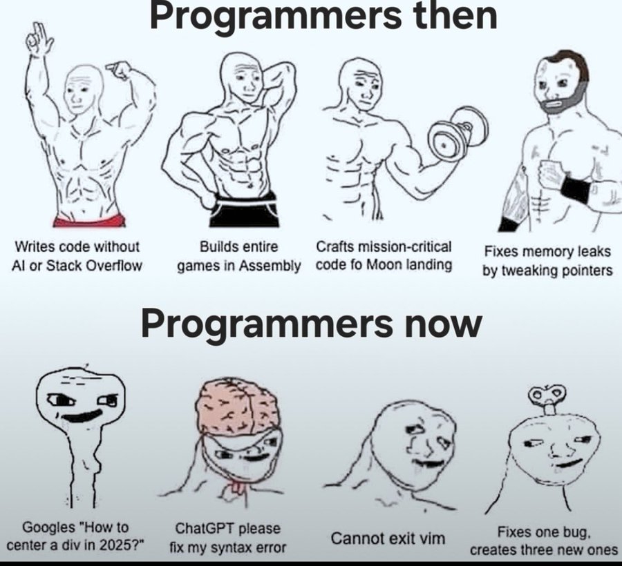

## Context:

Week 14 was een week van bouwen en doorgeven. Ik werkte aan een template dat ik uiteindelijk aan Manu heb overgedragen om af te maken, zette stappen vooruit op de CV engine voor de statuspage en feedbackmodule, startte de Intercom integratie voor de Word plugin op, en werkte verder aan het testing platform. Donderdagochtend was ik afwezig door school.

## Wat heb ik gedaan:

- **Template uitgewerkt en doorgegeven**: template opgebouwd en aan Manu overgedragen voor de afwerking.
- **CV engine verder uitgebouwd**: verder gewerkt aan de CV engine in het kader van de statuspage en de feedbackmodule. Voortgebouwd op de bestaande structuur.
- **Intercom integratie opgestart**: begonnen met het toevoegen van Intercom aan de Word plugin. 191 feedback items als startpunt.
- **Testing platform verder uitgewerkt**: verdere stappen gezet in de uitbouw van het testing platform.

## Blockers:

- **Donderdagochtend afwezig**: school van 9 tot 11 uur.

## Resultaat:

- Template klaar en overgedragen aan Manu.
- CV engine verder uitgebouwd voor statuspage en feedback.
- Intercom integratie opgestart voor de Word plugin.
- Testing platform verder uitgewerkt.

## Volgende stappen:

- CV engine voor statuspage en feedbackmodule verder afwerken.
- Intercom integratie met Word plugin verder uitbouwen.
- Testing platform verder documenteren en uitbouwen.

## Reflectie:

Deze week is er iets geland dat ik niet naast me neer wil leggen: ik moet meer code nalezen in plaats van te vibe coden. Het is verleidelijk om snel iets werkend te krijgen en verder te gaan, maar het risico is dat je de controle verliest over wat er eigenlijk in je codebase zit. Code begrijpen is niet hetzelfde als code laten genereren. Dat verschil heeft impact op hoe je bugs opspoort, hoe je refactort, en uiteindelijk op de kwaliteit van wat je levert.

Het doorgeven van de template aan Manu was een bewuste keuze. Het werk was opgestart en tot op een punt gebracht waar het overdraagbaar was. Dat soort handoffs gaan enkel vlot als de code leesbaar is en de context duidelijk is — weer een reden om meer tijd te investeren in code lezen en begrijpen in plaats van blindelings verder bouwen.

De Intercom integratie voor de Word plugin is een concrete stap in het verbeteren van de feedbackloop met gebruikers. 191 items is een goede dataset om mee te werken.

## Samenvatting:

- Template uitgewerkt en overgedragen aan Manu
- CV engine verder gebouwd voor statuspage en feedbackmodule
- Intercom integratie opgestart voor Word plugin (191 items)
- Testing platform verder uitgewerkt
- Reflectie: minder vibe coden, meer code nalezen en begrijpen
- Donderdagochtend afwezig door school
