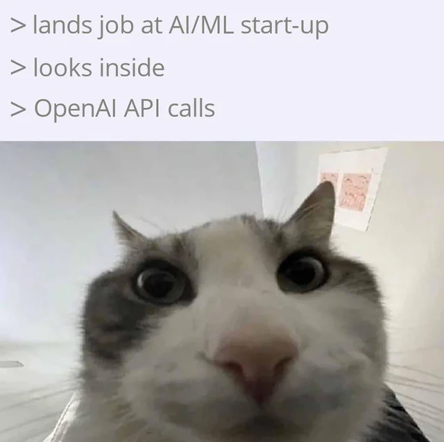

## Context:

Week 15 was een week met veel technisch onderzoek en overleg. De grootste focus lag op de start van de Groq feedback loop implementatie: een systeem dat de CV output verbetert via een AI review stap. Daarnaast OOXML validatie geëxploreerd, de AI agent architectuur besproken, en enkele sprint tickets en bugfixes afgerond. Donderdag was Hemelvaartsdag.

## Wat heb ik gedaan:

- **Groq feedback loop — start implementatie**: begonnen met de implementatie van een feedback loop die via Groq (een service voor snelle AI responses) de output van de CV engine verbetert. Het idee is een tweestaps aanpak: een eerste call die per generation kijkt waar de problemen zitten (bv. de skills fields of een beschrijving), en een tweede call die op basis daarvan enkel de betrokken velden aanpast. De AI krijgt zoveel mogelijk context voor een volledig beeld, maar de output wordt bewust beperkt tot de relevante velden — input tokens zijn goedkoop, output tokens niet. Limiet: maximaal 5 seconden extra generation time voor de gebruiker.
- **Groq logging — overleg met Guillaume**: overleg gehad over hoe de logs opgeslagen worden. Mijn eerste idee was een aparte tabel verbonden met de bestaande CV processing logs. Guillaume gaf de voorkeur aan blob storage omdat de JSON-structuur nog kan variëren. Ik heb twijfels over die aanpak en denk aan een tussenoplossing: een tabel met metadata (hoeveel keer gerund, link naar input en output data) en de ruwe JSON in blob. Meerdere oplossingen onderzocht en gedocumenteerd, bewijs bijgehouden in de logs.
- **Testing platform research**: research afgewerkt en overlegd met Guillaume. History endpoint besproken en toegevoegd als resultaat van dat overleg.
- **Intercom integratie toegevoegd**: Intercom geïntegreerd in de Word plugin. Lokaal waren er SSL-problemen omdat localhost als onveilig werd beschouwd, maar in productie is dat geen issue.
- **Assistent bug gefixt (in review)**: bug opgelost waarbij de oude chat van een vorige generation bleef staan als de gebruiker een nieuwe generation startte. Fix staat in review.
- **Feedback state bug gefixt**: feedback verdween bij het navigeren tussen de assistent en de analytics pagina. Opgelost door de state op te slaan in localStorage.
- **Google Docs plugin naar card-style omgezet**: de Google Docs plugin omgebouwd naar een card-stijl sidebar plugin. Logo ook afgerond.
- **Maandelijkse e-mails via back-end**: de maandelijkse e-mails worden nu via de eigen back-end verstuurd in plaats van een externe service.
- **Legacy plan validatie gefixt**: legacy plans werden niet als geldig geaccepteerd in self-service. Gefixt zodat het management platform en de company correct worden aangemaakt.
- **D-136 ticket (status controller)**: variabele mismatch gevonden en opgelost in dev, klaar voor productie.
- **BNP/Kronos template online**: fixes getest en toegang gegeven aan Savannah en Christine voor de eerste klanttest.
- **OOXML validatie geëxploreerd**: package gevonden dat OOXML validatie doet voor het XML-formaat van Word. Bijna alle templates zijn technisch invalide door strikte ordering rules. Kan programmatisch onderscheid maken tussen fixable errors en breaking issues.
- **Aikido MCP geconfigureerd**: Aikido MCP geïnstalleerd in Claude Code, enkel actief bij commits en PR's — niet bij elke prompt.

## Blockers:

- **Donderdag Hemelvaartsdag**: feestdag, geen standup.
- **Logging strategie Groq nog niet beslist**: twijfel tussen pure blob storage (Guillaume) en een tussenoplossing met metadata tabel + blob. Moet verder worden uitgewerkt.
- **Proof of concept AI agent nog niet gestart**: architectuur is duidelijk, implementatie staat nog open.

## Resultaat:

- Groq feedback loop opgestart: tweestaps aanpak bepaald, onderzoek gedocumenteerd.
- Testing platform research klaar, history endpoint toegevoegd.
- Intercom integratie klaar voor Word plugin.
- Assistent bug (oude chat blijft staan) gefixt, in review.
- Feedback state bug opgelost via localStorage.
- Google Docs plugin klaar als card-stijl sidebar.
- D-136 ticket klaar voor productie.
- BNP/Kronos template live voor Savannah en Christine.
- OOXML validatie: fixable vs breaking errors kunnen programmatisch worden onderscheiden.

## Volgende stappen:

- Logging strategie voor Groq feedback loop finaliseren (tussenoplossing uitwerken).
- Groq implementatie verder bouwen en testen (onder 5 seconden houden).
- Proof of concept AI agent opzetten (tool calls + XML aanpassingen).
- Groep validatie oppakken nu sprint tickets afgerond zijn.
- BNP/Kronos klantfeedback verwerken.

## Reflectie:

De discussie over de Groq logging raakte iets wat ik vaker tegenkom: het verschil tussen wat snel werkt en wat later nog beheerbaar is. Blob storage is flexibel zolang de structuur nog verandert, maar het maakt het moeilijker om later te querien of patronen te zien in de data. Een tussenoplossing met metadata in een tabel en de ruwe JSON in blob geeft beide: je kunt snel filteren op "hoeveel keer gerund" of "welke input", en de flexibiliteit van JSON blijft voor de details.

Wat ook opviel bij het uitwerken van de tweestaps aanpak: de beperking op output tokens dwingt je om preciezer te denken. Welke velden zijn het probleem? Hoe beschrijf je dat zo dat een tweede call er nuttig mee aan de slag kan? Dat is preciezer dan "geef de hele CV mee en pas aan". Het dwingt de AI om met minder context meer te doen op de juiste plekken.

## Samenvatting:

- Groq feedback loop opgestart: tweestaps aanpak (diagnose → patch per veld)
- Logging strategie besproken met Guillaume, tussenoplossing in onderzoek
- Testing platform research klaar, history endpoint toegevoegd
- Intercom integratie toegevoegd aan Word plugin
- Assistent bug gefixt (oude chat bleef staan bij nieuwe generation), in review
- Feedback state bug opgelost via localStorage
- Google Docs plugin omgebouwd naar card-stijl sidebar
- D-136 ticket opgelost (variabele mismatch)
- BNP/Kronos template live voor klant (Savannah + Christine)
- OOXML validatie geëxploreerd: fixable vs breaking errors
- Aikido MCP geconfigureerd in Claude Code (enkel bij commit/PR)
- Donderdag feestdag (Hemelvaartsdag)
