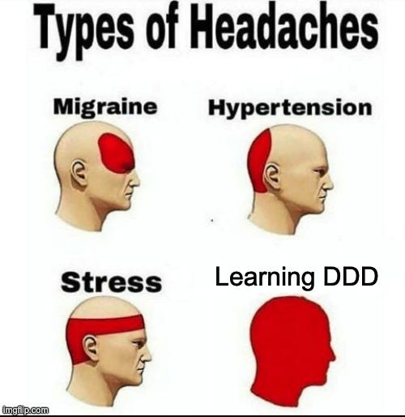

## Context:
Deze week zat ik met mijn neus in een mix van React en Java. De bug in onze Word plugin was gelukkig snel gefixt. React aan als thuiskomen na het doen van taken in nieuwe talen.

Daarna dook ik in Java om mijn eerste endpoint te bouwen. Op zich valt Java wel mee, maar DDD zorgt ervoor dat ik voor elke piepkleine wijziging weer een mapje en extra bestand moet verzinnen. Niet super glamorous, wel leerzaam.

We misten een zichtbare versie-indicator voor de API, dus ik heb nu geregeld dat elke deploy een bestandje met de commit-hash dropt. Klinkt klein, scheelt straks een hoop gokwerk.

Het loggingsstuk was pittiger. We hebben twee endpoints die hetzelfde proberen te doen, maar eentje loopt via de frontend en de andere wordt via een mail getriggerd. Ik heb de gedeelde logica naast elkaar gelegd en daar een loggingflow op gebouwd: errors versturen we naar het dev team, happy path logs gooien we weg.

Ondanks dat Java-traject wat moeizamer gaat, voel ik elke dag de leercurve. Props naar Guillaume en de rest van het team voor het geduld en de ruimte om te blijven crashen en leren.

 
 

## Volgende stappen:
- Dashboardbugs eruit trekken
- Logging testen
- Verder sleutelen aan de testing setup

## Samenvatting:
- React bug in de Word plugin opgelost
- Eerste Java endpoint gebouwd en commit-hash zichtbaar gemaakt
- Logging afgestemd tussen frontend- en mailflow
- DDD-structuur beter leren kennen (en er toch een beetje op gevloekt)