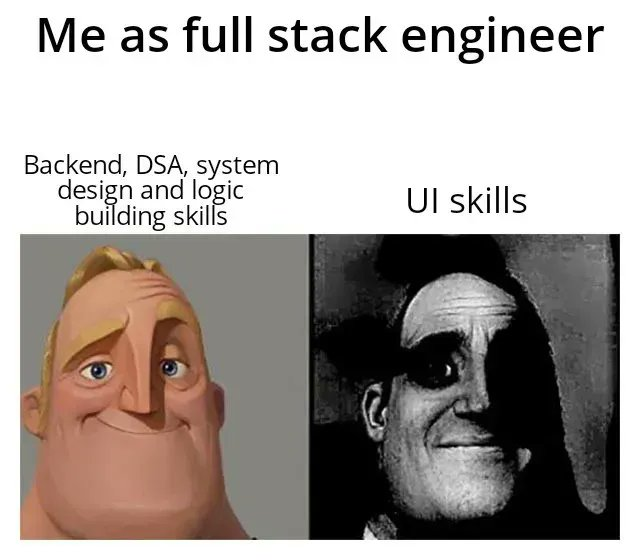

## Context:
Deze week stond in het teken van het verbeteren van onze logging en het verbeteren van de UI met AI-assistentie. De logging-setup is verder uitgerold en de belangrijke workflows krijgen nu een consistente log wanneer fouten optreden. De cv-build functie krijgt nu een log als parameter en de foutafhandeling maakt gebruik van try/catch zodat exceptions netjes gelogd worden. Die log wordt meegegeven aan de mail-functie zodat de mailinhoud ook gestyled kan worden met HTML in plaats van platte tekst, wat het overzichtelijker maakt.

Ik heb ook bugs in het dashboard gefixt. Dit verliep sneller doordat het merendeel kleine aanpassingen betrof en ik de React-kennis van de eerdere sprint kon toepassen. Het testen was lastig door beperkte testomgevingen de eerste twee dagen.

Vrijdag was er een meeting van 2 uur om de nieuwe co-founder te leren kennen en te zien wat er veranderd is in de workflow. Agile werken is nu de standaard. Tijdens die meeting was er ook een workshop over AI en hoe we AI kunnen inzetten tijdens het werk.
Ze kregen ineens Claude-code toegang. Dit kwam goed van pas toen ik aan de mail-sjabloon werkte. ik vroeg Claude om HTML en CSS te schrijven. Mijn UI-skills zijn niet top, maar Claude produceert mooie UI als je de prompt goed geeft.

## Volgende stappen:
- comparision maken met competor qua kwaliteit 
- Logging tests uitbreiden
- pr revieuws nakijken
- nieuwe tickets starten

## Samenvatting:
- Logging uitgebreid en geïntegreerd met mailflow
- Eerste UI-styling gegenereerd via AI (Claude)
- Dashboard-issues opgelost en getest
- Agile workflow verder omarmen