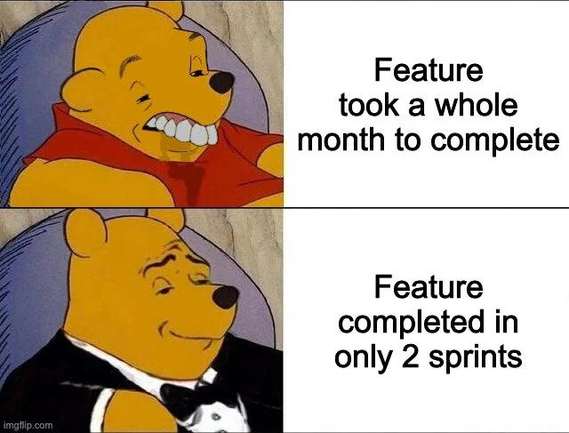

## Context:
Deze week ben ik bezig geweest met verder gebruiken van AI-tools. Zo heb ik veel gebruik gemaakt van Claude Code voor code te schrijven en voor code reviews.
Ik heb opgemerkt dat als er genoeg context in de ticket staat, het ticket al genoeg is voor de tool om de nodige changes te maken. Het is handig om per stap te vragen of dit een goed idee is volgens de gebruiker. We zijn ook bezig geweest met Agile werken en merken we dat sommige taken snel automatisch kunnen verlopen. Bijvoorbeeld, als een item in Ready for Review wordt gezet, komt er een automatische melding zodat de reviewer weet dat het in orde is.
Het volgende wat ik ga proberen te automatiseren is het aanmaken van pull requests en branches gebaseerd op een ticket. Mijn workflow is als volgt: kijk naar het ticketnummer, maak een branch met een passende naam over de issue, publiceer de branch, maak een pull request en link de items. Dit is de basis; als ik een review wil, zet ik het ticket op publish. Ik wil alles via de CLI doen zodat ik grotendeels kan automatiseren.
De tickets deze week waren vooral TSX-georiënteerd en ik heb enkele issues in de CV-log mail herbekeken. Een ander ticket was de temp blob storage voor candidate notes zodat we die voor een week kunnen naslaan als er ergens een bug is. Een interessant ding om te weten is dat je eerst de DB-changes moet committen op een andere branch voordat je de code schrijft. Volgende ticket zal gericht zijn op het schrijven van tests en zorgen dat de candidate notes beschikbaar zijn via de frontend.
## Volgende stappen:
- Create automated PR/branch workflow based on ticket number and publish status
- Implement CLI-driven automation for ticket-to-branch-to-PR flow
- Extend TSX-related test coverage for new components
## Samenvatting:
- AI tooling used for code generation and reviews (Claude)
- Agile workflow improvements; automation opportunities identified
- Temp blob storage ticket created for candidate notes with week-long visibility