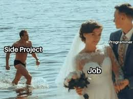

## Context:
Deze week merkte ik dat ik vaak dezelfde stappen herhaal: ticket activeren, branch aanmaken en publiceren, linken aan het ticket, en na afloop een pull request openen en het ticket naar Review zetten. Daarom heb ik een klein side-project gebouwd om dit via de CLI te automatiseren en meteen een overzicht van tickets te geven.

Daarnaast heb ik onderzocht hoe we sneller naar de sandboxes kunnen deployen: lokaal triggeren vs telkens via de Azure DevOps pipeline. Ik heb ook kleine verbeteringen gedaan aan het management dashboard.

Ik ben gestart met een nieuwe ATS integratie. Daarvoor heb ik eerst de REST endpoints onderzocht. De endpoints zijn nogal ongewoon geformatteerd; na het onderzoek kon ik duidelijk documenteren welk patroon te volgen en die context delen met de reviewer. De code oogt daardoor anders dan standaard REST, maar met de onderbouwing is het begrijpelijk.

Woensdag ben ik ook naar een event gegaan om verder te leren en te netwerken.

## Volgende stappen:
- CLI-tool afronden voor ticket->branch->PR flow en automatische linking
- Optie bouwen om sandbox deployments lokaal te triggeren met veilige guards
- Wrapper/fetch helpers toevoegen voor de ATS endpoints en consistentie documenteren
- Basis tests schrijven voor de eerste ATS integratiepaden
- Kleine UX-verbeteringen aan het management dashboard doorvoeren

## Samenvatting:
- Side-project gestart om repetitieve ticket/PR stappen te automatiseren
- Onderzoek gedaan naar lokale vs pipeline sandbox deployments
- ATS integratie opgezet; endpoints onderzocht en gedocumenteerd (niet-standaard REST)
- Reviewer voorzien van onderbouwing waarom het patroon afwijkt
- Kleine wijzigingen aan management dashboard en een leer-event bijgewoond
