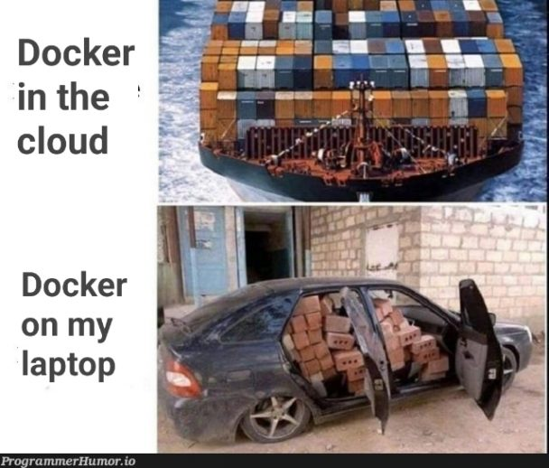

## Context:
Deze week stond in het teken van het afronden van de ATS-integratie en het versnellen van de lokale ontwikkel- en deployflow. De serverkant bleek lastiger dan verwacht door configuratiekwesties en ongewone API-endpoints. Daarnaast heb ik een lokale workflow opgezet waarmee ik via de CLI Docker-images kan bouwen, pushen naar Azure Container Registry en direct sandboxes kan updaten.

## Wat heb ik gedaan:
- Server/API van de ATS-integratie op orde gebracht: configuratie opgeschoond en de call-flow gestabiliseerd zodat endpoints consistent werken.
- Frontend-onderdelen voor de ATS-flow opgezet; die kant ging relatief vlot dankzij de eerder gedocumenteerde patronen.
- Lokale deploymentflow toegevoegd: via een CLI-script bouw ik een Docker-image, push ik die naar de registry en update ik de sandbox van de gebruiker naar de nieuwe tag via Azure CLI.
- Nieuwe base image gemaakt met Maven dependency cache. Bij wijzigingen in dependencies wordt de laag invalide en opnieuw opgebouwd; anders hergebruiken we de cache.
- Research gedaan naar nieuwe services en local DX.

## Resultaat:
- Build- en opstarttijd van ~10 minuten teruggebracht naar onder de 3 minuten, stabiel reproduceerbaar.
- Minder afhankelijk van volledige pipeline-runs; lokale iteraties gaan sneller met directe feedback.
- Duidelijker configuratie en minder verrassingen bij het aanroepen van de ATS-endpoints.
- Documentatie beschikbaar voor het team, wat review en overdracht versnelt.

## Volgende stappen:
- Ats intergratie verder afwerken.
- Onderzoek starten promptfoo.
- Start overschakeling naar nieuwe auth.

## Reflectie:
Ik heb deze week verrassend veel gedocumenteerd en onderzocht. Nieuwe dingen uitproberen en pragmatisch kiezen wat werkt, vind ik leuk: probleem scherp stellen, opties onderzoeken, documenteren en een beslissing nemen. Dat voelt anders dan op school; daar werk je vaker vanuit vaste requirements, terwijl ik hier meer vrijheid heb om tot een goede oplossing te komen en die te onderbouwen.

## Samenvatting:
- ATS-integratie afgerond; serverconfig en endpoints gestabiliseerd
- Lokale CLI-flow: build, push naar ACR, sandbox updaten via Azure CLI
- Maven-cache in Docker-image maakt builds veel sneller (<3 min)
- Documentatie en beslisnota geschreven. team kan hiermee vooruit
