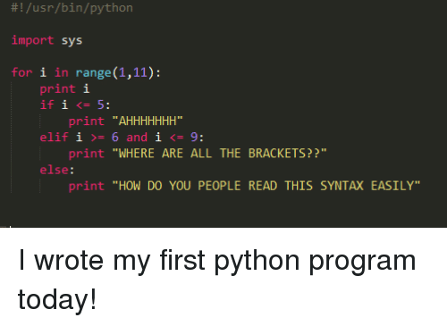

## Context:
Deze week stond in het teken van het afronden van de Aikido-documentatie, het schrijven van mijn eerste Python-code en het verder uitbouwen van AI-automatisering in mijn dagelijkse workflow.

## Wat heb ik gedaan:
- Intervisie bijgewoond op donderdag vanuit school: zowel soft als technical skills besproken. Inzicht gekregen dat mijn professionele communicatie niet altijd op het juiste niveau zit — in een professionele context is een te informele spreekstijl niet gepast.
- Aikido werkt eindelijk correct voor PR-reviews: de inline comments met potentiële fixes zijn een sterke DX-verbetering. De Azure DevOps-integratie zorgt ervoor dat we niet continu naar een apart platform moeten wisselen.
- Aikido-documentatie volledig afgerond en een meeting gepland met een van de bazen om de aanpak voor de security tickets te bespreken.
- Voor het eerst Python-code geschreven. De DX van Python valt erg tegen vergeleken met TypeScript, Java en C#. Het gebruik van tabs als syntax, gecombineerd met andere conventies, dwingt je om aangeleerde gewoontes van andere talen los te laten. Het gaat gelukkig om een kleine wijziging die als API-call wordt toegepast in de main codebase via een microservice.
- Door het werken in de hele codebase (frontend, pipelines én backend) heb ik nu een beter overzicht van hoe alles in elkaar past.
- AI-routines opgezet die autonoom op een schema draaien: één routine maakt een dagplanning op basis van openstaande tickets en de notes van de daily standup, een andere beantwoordt automatisch berichten met behulp van een contextfolder voor specifieke vragen.
- Remote agents ingezet om zowel lokale als remote resources tegelijk te gebruiken voor zwaardere taken.
- Bug opgelost in de frontend bij het versturen van documenten.
- Maandag bijgewoond: "The Future", een gratis variant van het Supernova-event. Bedrijven stelden zich voor en investeerders en CEO's gaven presentaties. Interessant, maar had er meer van verwacht.

## Blockers:
- De AI-agent voor automatisch antwoorden stuurde enkele berichten opnieuw die al eerder verstuurd waren. Dit vereist verdere finetuning van de logica.

## Resultaat:
- Aikido volledig operationeel en gedocumenteerd; meeting gepland voor security tickets.
- Eerste werkende Python-code geschreven en toegepast als microservice-call.
- AI-routines draaien autonoom en reduceren manueel werk in dagelijkse planning en communicatie.
- Frontend bug opgelost.
- Volledig overzicht van de codebase door te werken in frontend, backend én pipelines.

## Volgende stappen:
- Meeting met de baas over de aanpak van security tickets opvolgen.
- De automatische antwoordagent verfijnen zodat duplicaten worden vermeden.
- Python-wijziging verder testen en integreren in de main codebase.

## Reflectie:
Deze week bevestigde opnieuw hoe sterk gewoontes zijn die je opbouwt in één taal. Python dwong me om bewust te zijn van syntax-aannames die ik normaal als vanzelfsprekend beschouw. Dat is ongemakkelijk, maar ook leerzaam. Aan de andere kant toonde de intervisie dat technische groei alleen niet genoeg is — hoe je communiceert in een professionele context is even belangrijk en vraagt even bewuste oefening.

## Samenvatting:
- Aikido gedocumenteerd en meeting gepland voor security tickets
- Eerste Python-code geschreven; moeilijke DX maar kleine en werkende wijziging
- AI-routines opgezet voor automatische dagplanning en berichtgeving
- Remote agents ingezet voor zwaardere taken
- Bug opgelost in frontend bij documentverstuur
- Bijgewoond: "The Future" event
